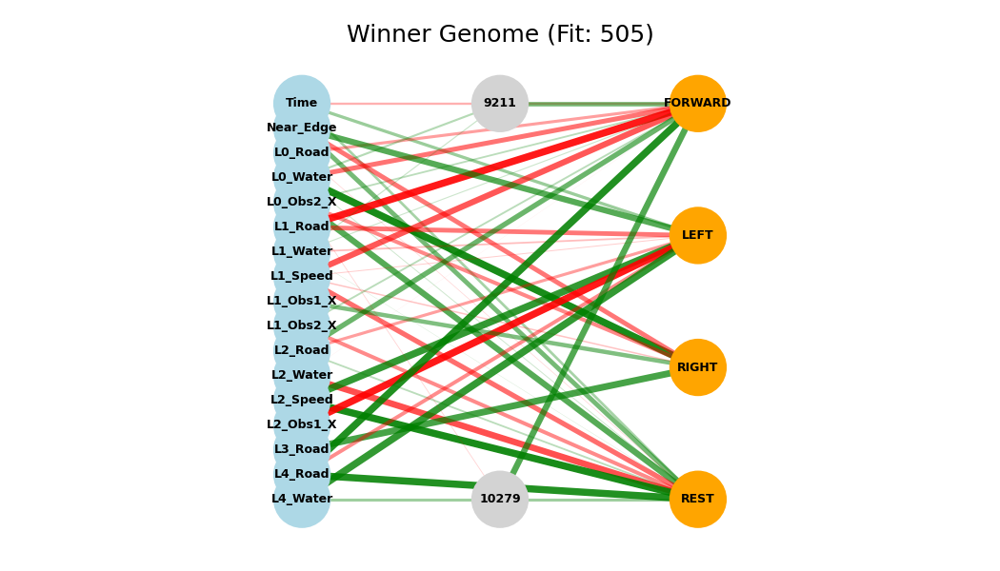

# README
## Froggy Road

### Introduction
This project was developed as part of the Optimization for AI course exam held by professor Luca Manzoni at the University of Trieste.
The game the project is based on consists of a frog that must advance on a field, but every step ahead could lead the poor beast to be smashed by a car or - what an oxymore! - to drown in a river. The neat part of the project consists in looking for a strategy that "solves" (i.e., makes the frog advance as far as possible) the game with an evolutionary approach. NEAT (NeuroEvolution of Augmenting Topologies) is the technique we adopted for our problem.

### Installation and replication
The requirements for running the game/evolution are: Python 3 installed with the libraries `pygame`, `neat-python` and `matplotlib` (required only in `simulation_network.py`). The project dependencies are managed by [`uv`](https://docs.astral.sh/uv/) for simplicity.

Thereafter, the user can clone this repo and run one of the following scripts:

1. `froggie.py`, just the game;
2. `simulation.py`, runs a 200-generations-long evolution;
3. `simulation_network.py`, runs a 200-generations-long evolution and shows the best runtime network, the best overall is saved as an image.

Remark 1: higher the FPS in `game_config.py` to speed up the process, although it takes anyway quite a while to finish 200 iterations.

Remark 2: redirect the output to a file to save the evolution process and the best network for a future moment (e.g., ``python3 simulation_network.py > simulation.txt``).

### Game rules and details

At each phase of the game 5 lanes are visible. Each lane is either made of grass, asphalt, or water. Collision with a car causes the frog's death, on the other hand, jumping on a floating log is the only safe way to cross a river. Grass is perfectly safe. The frog can only move forward, to the left or to the right. Never backwards.

Each scenario starts with the same pattern grass-road-road-grass-river, afterwards it becomes random and changes at every replication. Each lane is generated with a Markovian process that tends to make (bigger) road clusters and (smaller) water clusters. The probability of finding grass decays over time, but there are never two consecutive lawns.

Also the spawn rate of cars and logs changes over time, making the game more and more difficult.
A few adjustments were made to prevent situations impossible to overcome, although this is not granted at all.

### The evolution phase

#### Inputs and outputs

A list of 20 input variables has been selected:

- 1x how-long-frog-resting (log transformation)
- 1x near-edge (-1 if near to the left edge, 1 if near to the right edge, 0 otherwise)
- 3x 3-nearest-lane-speed
- 5x is-lane-made-of-asphalt
- 5x is-lane-made-of-water
- 5x vehicle-relative-horizontal-distance (2 for the current lane, 2 for the next one, 1 for the over-next-one)

There are obviously many other possibilities, like different encodings, variables or transformations. These inputs were selected after a few (three) attempts, but whether they are the most efficient possible is not ensured at all, in fact it is probably false. On the other hand, 20 variables are not few, and adding more could lead to a lot of mischieving mutations and crossovers, making evolution slower. Changing or trasforming variables seems a more sensible alternative.

The outputs are of course:

- GO TO THE LEFT
- GO TO THE RIGHT
- GO AHEAD
- REST

#### The fitness

At the beginning the frog starts with a zero fitness, but every step taken forward gives a prize of 20, dying gives a 15 points penalty, the frog is also punished for trespassing the edges (-5). The frog loses up to 15 points if it waits for too long, then it dies.

Using a good fitness function is probably almost as important as choosing the correct inputs, but in this case no other attempts were made.

#### NEAT parameters

The NEAT configuration file is named inside this repository as `neat-config.txt` and contains almost all the NEAT parameters. 

- The number of children is 500 at each generation (Note that they all share the same scenario, for visualization purposes).
- The activation function is softplus, not mutable.
- Mild elitism is performed (2 best from previous generation).
- Only the best 10% of each species is allowed to reproduce.
- The compatibility threshold is set to 2.8, quite high, to limit too frequent speciation. A maximum of 6 species was counted midway through the evolution.
- All other parameters were kept to their respective defaults.

Using bad hyperparameters has led to some odd behaviour. For example, evolution with a compatibility threshold of 1.6 (more speciation) tended to get stuck around a score of 65.00 for all the species, which means that almost no individual could make it after the fourth lane.

#### Evolution insights

Most of the points about the importance of the inputs, of the fitness function and of the NEAT hyperparameters were already made.

However, here is the video of some highlight moments of the evolutive process, followed by the fittest network found in 200 generations.

https://github.com/user-attachments/assets/8f4cfc62-58ab-4b42-a57b-6caef19080d7

### Conclusions

Despite its silly name, thinking that froggy-road is an easy game for NEAT is deceiving. Probably due to bad selection of the input set, or maybe not, there are complex logics that evolution has to discover, but it cannot in reasonable time: a close obstacle can be salvation or damnation, and all of it depends on a couple of dummy variables. This belongs to the several control flows that a shallow network struggles to find out, and adding more generations seems not to improve the situation. As a matter of fact, the "brain" of the leader becomes simpler and simpler as the iterations grow (bad NEAT mutation hyperparameters?). In addition to this, odd logics appear even in the network that theoretically performed better than all the others... As we can see in the picture above, among all the other obscure relations (they are randomly generated after all), time has a negative effect on going forward and a positive effect on staying still, which does not make much sense, and also the fact that being on a road leads to stay, but having one ahead prevents the frog from jumping sounds illogic. A possible explaination is that that genome reached such an high score by pure chance, not in an evolutive sense, but because there was likely a really easy gameplay, hence that neural network probably wouldn't perform just as well in another scenario.

Nevertheless, there is one sensible logic that appeared in multiple evolutive processes, that is that the variable "Near Edge" has a positive effect on output LEFT and a negative effect on the output RIGHT, which is perfectly reasonable.

The results are altogether not as satisfactory as hoped, however, there is no average fitness lower than 30.0 after generation 24, and this is sign of constant (yet slow, sadly) improvement of the population, and - most important - all of this information remains an extremely valuable source of learning, to reference on future occasions.

### Resources and references

- NEAT-Python — NEAT-Python 1.1.0 documentation. [https://neat-python.readthedocs.io/en/latest/index.html](https://neat-python.readthedocs.io/en/latest/index.html). Accessed 2 February 2026.
- Car sprites were retrieved at [https://marcusvh.itch.io/2d-cars](https://marcusvh.itch.io/2d-cars)

---
Giovanni Zedda, MSc student in Data Science and Artificial Intelligence

University of Trieste, 2 February 2026

---

